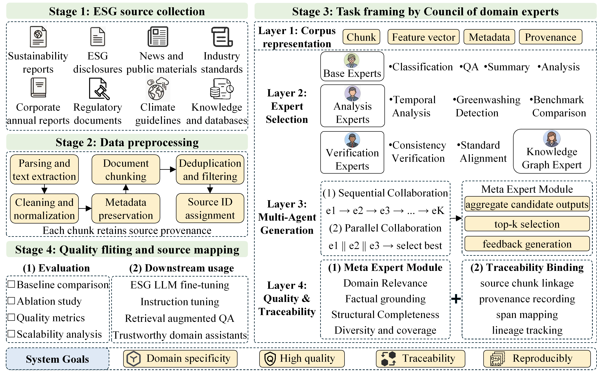
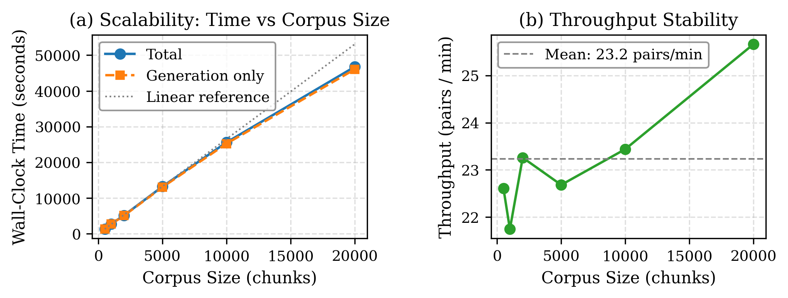

# VeritasCarbon

> **VeritasCarbon: A Scalable Multi-Agent Framework for Generating Traceable ESG Instruction Data**
>
> **Submitted to VLDB 2027** — Research Track

[](LICENSE)
[](https://www.python.org/)

## Overview

VeritasCarbon converts **17,721 ESG disclosure documents** into **35,009 traceable instruction–response pairs** through a multi-agent pipeline. At its core is **CoDE (Council of Domain Experts)**, a framework that organizes 11 specialized expert agents into a four-layer hierarchy, coordinating their generation through parallel or sequential collaboration with iterative MetaExpert feedback.

**Key Results:**
- 4.0× higher ROUGE-L, 4.6× higher BLEU-4, 14.6× higher domain relevance vs. best baseline
- All experiments use the same Qwen2-72B-Instruct model (4-bit quantized, on-premises) for fair comparison
- Every generated QA pair retains source mapping for full data provenance

<p align="center">
  
  <br>
  <em>Figure 1: The VeritasCarbon pipeline — from raw ESG documents to traceable instruction data.</em>
</p>

## Repository Structure

```
VeritasCarbon-VLDB2027/
├── configs/
│   └── config.yaml              # Central configuration (model, CoDE, paths)
├── src/
│   ├── data_processing/         # Document parsing, chunking, quality check
│   │   ├── document_parser_01_02.py
│   │   ├── text_chunker_01_03.py
│   │   └── data_quality_check_01_04.py
│   ├── instruction_generation/  # CoDE framework and experiments
│   │   ├── expert_selector_02_01.py      # 4-layer expert selection
│   │   ├── domain_knowledge_02_02.py     # ESG knowledge injection
│   │   ├── coe_framework_02_03.py        # Multi-expert collaboration
│   │   ├── expert_agents_02_04.py        # 11 specialized expert types
│   │   ├── meta_expert_02_09.py          # MetaExpert orchestration
│   │   ├── baseline_local_03_01.py       # 3 baseline methods
│   │   ├── ablation_local_03_02.py       # 4-dimension ablation
│   │   ├── intrinsic_evaluation_03_03.py # 7 intrinsic metrics
│   │   └── dataset_statistics_03_04.py   # Tables & figures generation
│   ├── evaluation/
│   └── utils/
├── data/
│   ├── raw_corpus/              # Sample ESG documents (full corpus: 17,721 docs)
│   │   ├── Layer1/samples/      # Domain textbooks (2 samples)
│   │   ├── Layer2/samples/      # CSR reports (2 samples + metadata)
│   │   ├── Layer3/samples/      # Regulatory guidelines (2 samples)
│   │   ├── Layer4/samples/      # Industry analyses (2 samples)
│   │   └── CORPUS_MANIFEST.md   # Full listing of all 17,721 documents
│   ├── processed_corpus/        # Semantically segmented chunks
│   │   └── chunks_sampled_20000_by_year.jsonl
│   ├── instructions/            # Generated QA pairs (full set on Hugging Face)
│   │   ├── qa_pairs_complete_v3_1.5w.jsonl  (15,000 pairs)
│   │   └── qa_pairs_complete_v3_2w.jsonl    (20,000 pairs)
│   ├── instruction_datasets/
│   │   └── train.jsonl           # Final training set
│   └── sample/                   # Representative 2,000-pair sample (in repo)
│       └── veritascarbon_sample_2000.jsonl
├── results/
│   ├── baselines/               # Direct / Self-Instruct / WizardLM-Evol
│   ├── ablation/                # Expert count / Collaboration / Feedback / Knowledge
│   ├── figures_and_tables/      # Generated figures and LaTeX tables
│   └── outputs/                 # Intrinsic evaluation CSVs
├── notebooks/
│   ├── 01_DataPreprocess.ipynb
│   ├── 02_InstructionGeneration_v3.ipynb
│   └── 03_SIGMOD_Experiments.ipynb
├── scripts/                     # Generation and monitoring utilities
├── paper/figures/               # Paper figures (cleaned)
├── requirements.txt
└── README.md
```

## Installation

```bash
# Clone
git clone https://github.com/YihanJIANG-lab/VeritasCarbon-VLDB2027.git
cd VeritasCarbon-VLDB2027

# Create environment
conda create -n VeritasCarbon python=3.10 -y
conda activate VeritasCarbon
pip install -r requirements.txt

# Download model (Qwen2-72B-Instruct, 4-bit quantized via Unsloth)
# Place at: models/Qwen2-72B-Instruct/
```

## Quick Start

### 1. Data Preprocessing
```bash
# Process raw ESG documents into semantic chunks
jupyter notebook notebooks/01_DataPreprocess.ipynb
```

### 2. Instruction Generation (CoDE Framework)
```bash
# Generate QA pairs using Council of Domain Experts
jupyter notebook notebooks/02_InstructionGeneration_v3.ipynb
```

### 3. Run Experiments
```bash
# Baselines, ablation, intrinsic evaluation
jupyter notebook notebooks/03_SIGMOD_Experiments.ipynb
```

## CoDE Framework

<p align="center">
  
  <br>
  <em>Figure 2: CoDE internal architecture — (A) 4-layer expert hierarchy, (B) MetaExpert orchestration, (C) collaboration modes, (D) feedback loop.</em>
</p>

The CoDE (Council of Domain Experts) framework operates in three stages:

1. **Layered Expert Selection**: 11 agents organized into 4 layers (Base → Analysis → Verification → Graph). For each chunk, a feature vector triggers layer-by-layer activation, truncated to K experts (default K=3).

2. **Multi-Expert Collaboration**: Selected experts collaborate in parallel (independent generation + voting) or sequential (context-passing chain) mode.

3. **MetaExpert Feedback**: The MetaExpert extracts topics, synthesizes work instructions, and runs R feedback rounds (default R=2) with quality threshold τ=0.7.

### Expert Types (11 Specialists)

| Layer | Experts | Activation |
|-------|---------|------------|
| Base (Layer 1) | QA, Summary, Extraction, Classification, Analysis | Always ≥1 |
| Analysis (Layer 2) | Temporal, Benchmark, Greenwashing | Feature ≥ 0.3 |
| Verification (Layer 3) | Consistency, Standard Alignment | Numerical/standards |
| Graph (Layer 4) | Knowledge Graph | Entity-relation ≥ 0.5 |

## Dataset: VeritasCarbon-ESG-35K

| Statistic | Value |
|-----------|-------|
| Total QA pairs | 35,009 |
| Source documents | 17,721 |
| Semantic chunks | 20,000 |
| Expert types | 11 |
| Avg. instruction length | 106.5 chars |
| Avg. response length | 380.4 chars |
| Quality score (mean ± std) | 0.667 ± 0.103 |

### Data Availability

We release the dataset under a **tiered strategy** (see [`DATA_AVAILABILITY.md`](DATA_AVAILABILITY.md) for full details):

- **Sample (2,000 pairs)**: Included directly in this repository (`data/sample/veritascarbon_sample_2000.jsonl`). Drawn via `random.seed(42)` from the full pool; matches the evaluation protocol in Table 2 and is sufficient to replicate the main comparison experiment.
- **Full dataset (35,009 pairs)**: Hosted on [Hugging Face Datasets](https://huggingface.co/datasets/Yihan-JIANG/VeritasCarbon-ESG-35K) (`~153 MB`). Loadable in one line: `load_dataset("Yihan-JIANG/VeritasCarbon-ESG-35K")`.
- **Reproducible from source**: The raw corpus (~2.7 GB) contains copyrighted material and cannot be redistributed in full; we provide `CORPUS_MANIFEST.md` with complete provenance. Running the provided notebooks regenerates the identical 35,009-pair dataset.

**Format** (JSONL):
```json
{
  "instruction": "Based on the reported emissions data, analyze the trend...",
  "response": "The company's Scope 1 emissions decreased by 12.3%...",
  "metadata": {
    "chunk_id": "Layer1_doc_042_chunk_007",
    "expert_type": "analysis",
    "quality_score": 0.72,
    "source_mapping": ["Layer1/doc_042"]
  }
}
```

## Experimental Results

### Main Comparison (Table 1)

| Method | ROUGE-L | BLEU-4 | Distinct-2 | Domain Rel. | FactCheck |
|--------|---------|--------|------------|-------------|-----------|
| Direct Prompting | 0.0838 | 0.0424 | 0.0124 | 0.0197 | 0.8702 |
| Self-Instruct | 0.0407 | 0.0098 | 0.0033 | 0.0025 | 0.9336 |
| WizardLM-Evol | 0.0376 | 0.0119 | 0.0038 | 0.0249 | 0.5508 |
| **CoDE (Ours)** | **0.3380** | **0.1932** | **0.1061** | **0.3637** | **0.9478** |

### Key Ablation Findings

- **Expert Count**: K=3 optimal (quality 0.6453, +4.5% over K=1)
- **Collaboration**: Parallel best (quality 0.6473, +4.8% over none)
- **Feedback Rounds**: R=0 → R=2 shows clear improvement (quality 0.6264 → 0.6494, +3.7%)
- **Knowledge Injection**: +1.2% quality improvement (0.6273 → 0.6349)

## Configuration

Edit `configs/config.yaml`:

```yaml
model:
  name: Qwen2-72B-Instruct
  quantization: 4bit
  framework: unsloth

code:
  max_experts: 3          # K
  collaboration: parallel  # parallel | sequential
  feedback_rounds: 2       # R
  quality_threshold: 0.7   # τ

seed: 42
```

## Raw Corpus

The full corpus (17,721 documents, ~2.7 GB) is not included due to copyright.
Sample files are provided in `data/raw_corpus/Layer*/samples/`.
See `data/raw_corpus/CORPUS_MANIFEST.md` for the complete file listing.

**Corpus Layers:**

| Layer | Description | Documents | Chunks |
|-------|-------------|-----------|--------|
| Layer 1 | Domain textbooks | 97 | 8,877 |
| Layer 2 | CSR reports (2006–2024) | 17,425 | 5,395 |
| Layer 3 | Regulatory guidelines | 92 | 3,237 |
| Layer 4 | Industry analyses | 107 | 2,491 |

## Citation

```bibtex
@inproceedings{jiang2026veritascarbon,
  title     = {VeritasCarbon: A Scalable Multi-Agent Framework for Generating Traceable ESG Instruction Data},
  author    = {Jiang, Yihan},
  booktitle = {Proceedings of the ACM on Management of Data (PACMMOD)},
  
  year      = {2026}
}
```

## License

This project is licensed under the MIT License. See [LICENSE](LICENSE) for details.

The generated dataset (VeritasCarbon-ESG-35K) is released under [CC BY-SA 4.0](https://creativecommons.org/licenses/by-sa/4.0/).
